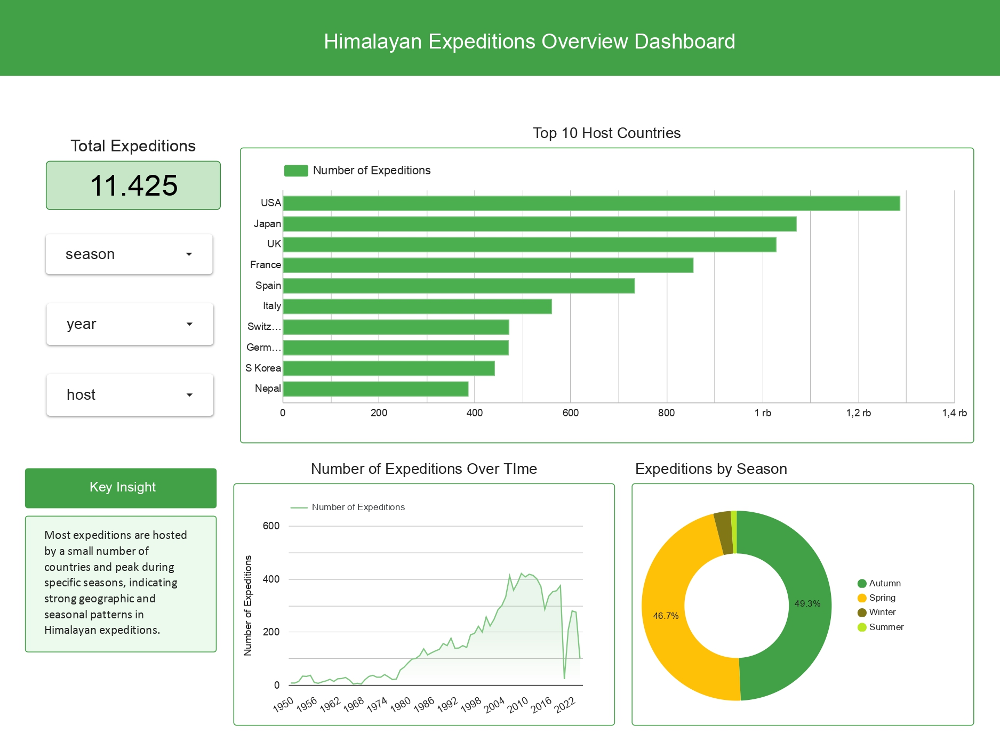

# 🏔️ Himalayan Expeditions Dashboard
## 📊 Dashboard Preview

🔗 **Interactive Dashboard:**  
[View on Looker Studio](https://lookerstudio.google.com/reporting/599b75b9-787d-4729-be70-8a8570dd3a95)

An interactive dashboard project that explores Himalayan expedition data to uncover geographic, seasonal, and temporal patterns using Looker Studio.

---

## 📌 Project Overview
This project analyzes Himalayan expedition records to understand how expedition activities vary across countries, seasons, and time.  
The analysis focuses on identifying dominant host countries, peak expedition seasons, and overall expedition trends.

---

## 🎯 Objectives
- Analyze the total number of expeditions
- Identify top host countries
- Explore seasonal expedition patterns
- Provide interactive filters for deeper exploration

---

## 🧹 Data Preparation
Data cleaning was performed using spreadsheet tools, including:
- Handling missing values
- Standardizing date and categorical fields
- Creating derived fields (Year, Season)

---

## 🛠️ Tools Used
- Google Sheets / Spreadsheet (Data Cleaning)
- Looker Studio (Data Visualization & Dashboarding)

---

## 🔍 Key Insights

- **Expeditions are concentrated in a few countries,** A small number of countries dominate Himalayan expedition activities, indicating unequal global participation and strong influence from countries with established mountaineering communities.

- **Expedition activity is highly seasonal,** Most expeditions take place during Spring and Autumn, while Winter and Summer contribute significantly fewer expeditions due to harsher conditions.

- **Expeditions have increased over time,** The number of expeditions shows a clear upward trend, reflecting growing global interest and improved access to Himalayan climbing.

- **Total Expeditions represent activity count,** The “Total Expeditions” metric counts expedition events, not physical measurements or individual climbers.

## 🌍 Overall Insight

Himalayan expeditions follow clear geographic, seasonal, and temporal patterns
Expedition activities are shaped by dominant host countries, optimal climbing seasons, and long-term growth trends.

---

## 📂 Dataset
- **Source**: Himalayan_Expeditions (RevoU Project)
- **Raw data**: 11,425  rows × 67 columns
> **Note:**  
> Due to GitHub file preview limitations for large datasets, only a **sample of 100 rows** is included in this repository for demonstration purposes. The full dataset was used during the data cleaning and dashboard development process in Looker Studio.

---

## 👩‍💻 Author
**Alisha Zaharani**  
Information Systems Student  
Data Analyst | Business Intelligence

---

## 🔗 Connect with Me
Feel free to explore the project and connect with me on [LinkedIn](https://www.linkedin.com/in/alishazaharani/)!
